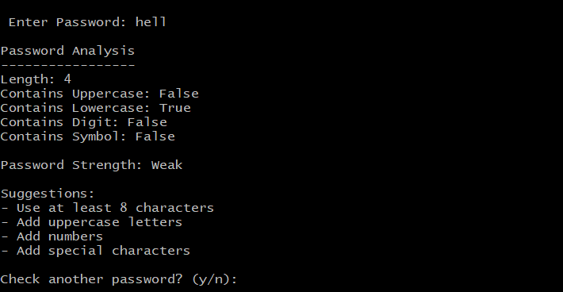
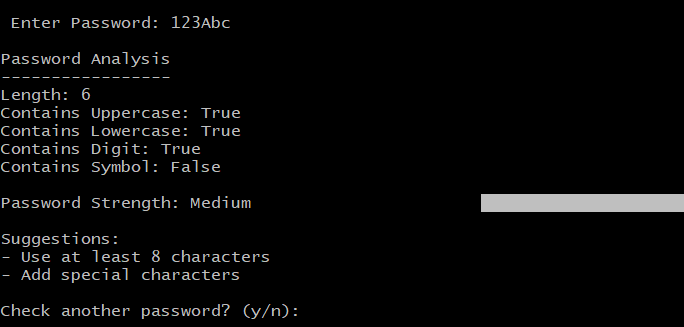
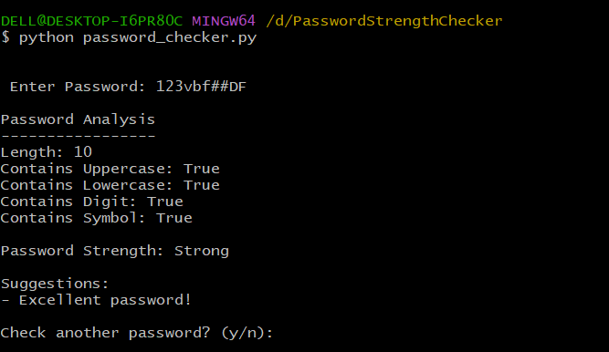

# 🔐 Password Strength Checker

A Python-based Password Strength Checker that analyzes passwords and classifies them as Weak, Medium, or Strong.

## Features

- Password Length Check
- Uppercase Letter Check
- Lowercase Letter Check
- Number Check
- Symbol Check
- Password Strength Analysis
- Security Suggestions

## Screenshots

### Weak Password



### Medium Password



### Strong Password



## Technologies Used

- Python
- CustomTkinter

## How to Run

```bash
pip install customtkinter
python password_checkergui.py
```

## Author

Faiza Sajjad